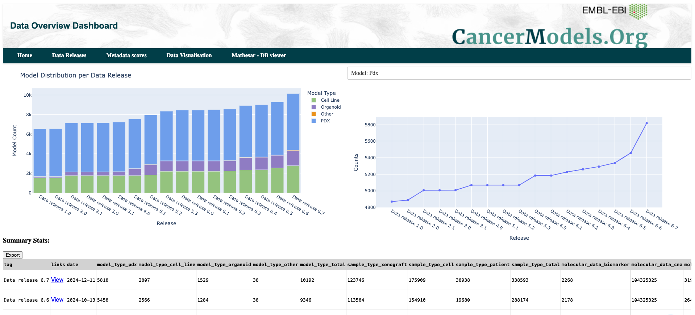
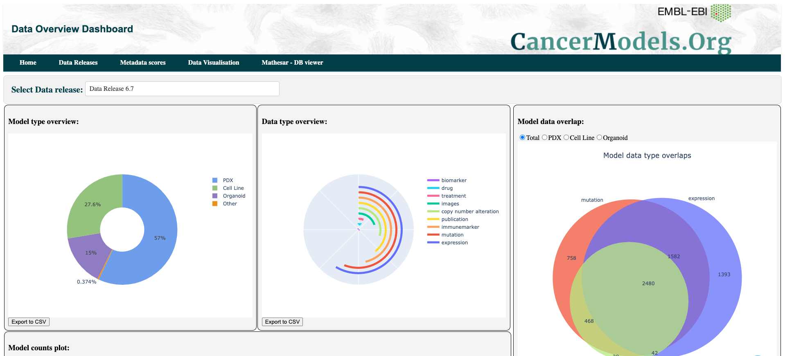
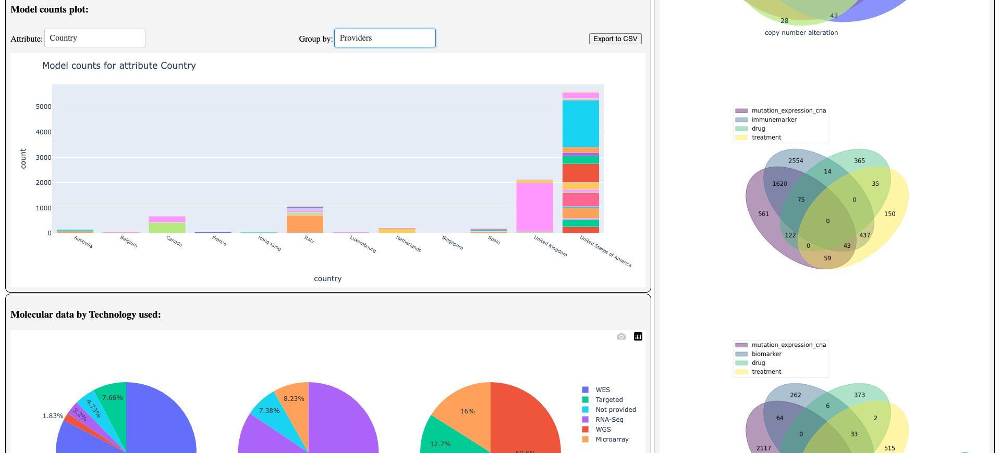

# CancerModels.Org - Data Dashboard

This data dashboard provides an interactive visualization of exploratory data analysis (EDA) across multiple data releases. 
It includes summary statistics, pie charts, bar charts, and tables to help users understand the distribution and trends in the dataset.

### Features
- Interactive visualization of summary statistics.
- Pie charts displaying the distribution of categorical variables.
- Bar charts showing the distribution of numerical variables.
- Tables presenting key metrics and descriptive statistics.
- Easily customizable to explore different aspects of the dataset.

### Usage
Clone the repository:
```
git clone https://github.com/PDCMFinder/data-dashboard.git
```
Install the required dependencies:
```
pip install -r requirements.txt
```

Run the data dashboard:
```
python main.py
```

Access the dashboard in your web browser at http://localhost:8050.

### Screenshots




### License
This project is licensed under the [MIT License](https://github.com/PDCMFinder/data-dashboard#MIT-1-ov-file).